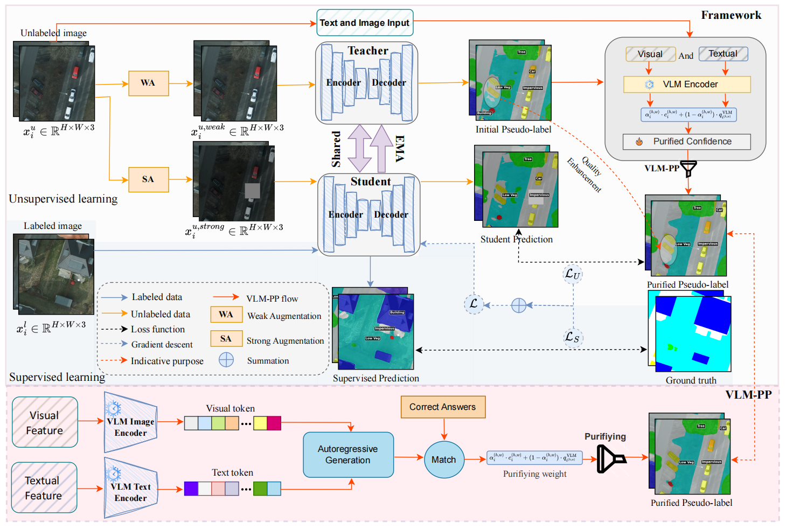

# SemiEarth

The code implementation of the SemiEarth.


### Environment
---
```
pip install -r requirements.txt
```

### Dataset
---
Download the processed [Datasets](https://pan.baidu.com/s/1DD_RUXiIcwBsJyCtPYkzRA). Code = ``yny6``.
Your file structure will be like:
```
├── [Your Dataset Path]
    ├── JPEGImages
        ├── img_001.jpg
        ├── img_002.jpg
        └── ...
    ├── SegmentationClass
        ├── label_001.png
        ├── label_002.png
        └── ...
```

### Pretrained Backbone
---
Download the pretrained [Checkpoints](https://github.com/facebookresearch/dinov2).
Your file structure will be like:
```
├── pretrained
    └── dinov2_small.pth
    └── ...
```

### Training and validation
---
```
sh scripts/train_love_1_100.sh 8 29501 29502 29503 29504 29505 29506 29507 29508
```
### Testing
---
```
python test.py --config configs/dataset.yaml --checkpoint 'best.pth'
```

### Determined AI
---
```
cd det_create
det e create det_4090.yaml .
```

### Citation
---
If you find it useful, please consider citing:
```
@article{wang2026vision,
  title         = {Vision-Language Model Purified Semi-Supervised Semantic Segmentation for Remote Sensing Images},
  author        = {Wang, Shanwen and Sun, Xin and Hong, Danfeng and Zhou, Fei},
  journal       = {arXiv preprint arXiv:2602.00202},
  year          = {2026},
  month         = feb,
  note          = {Available at \url{https://arxiv.org/abs/2602.00202}}
}
```
