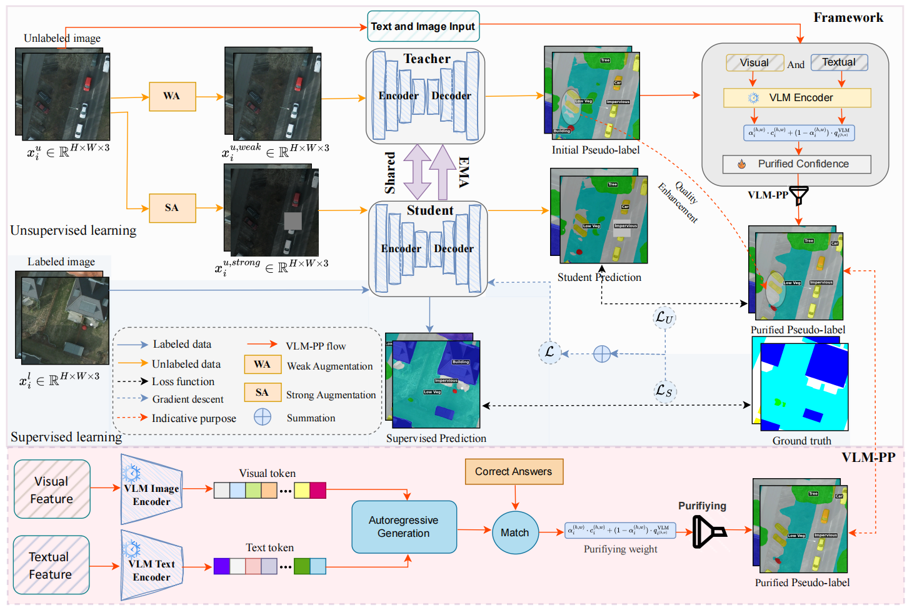

# SemiEarth

The code implementation of the SemiEarth.


### Environment
---
Please run the following script to install the SemiEarth runtime environment.
```
pip install -r requirements.txt
```

### Dataset
---
Download the processed [Datasets](https://pan.baidu.com/s/1DD_RUXiIcwBsJyCtPYkzRA). Code = ``yny6``.
Your file structure will be like:
```
├── [Your Dataset Path]
    ├── JPEGImages
        ├── img_001.jpg
        ├── img_002.jpg
        └── ...
    ├── SegmentationClass
        ├── label_001.png
        ├── label_002.png
        └── ...
```

### Pretrained Backbone
---
Download the pretrained [Checkpoints](https://github.com/facebookresearch/dinov2).
Your file structure will be like:
```
├── pretrained
    └── dinov2_small.pth
    └── ...
```

### Training and validation
---
Please run the following script to train the model and obtain the training metrics.
```
sh scripts/train_love_1_100.sh 8 29501 29502 29503 29504 29505 29506 29507 29508
```
### Testing
---
Please run the following script to test the model and obtain the evaluation metrics.
```
python test.py --config configs/dataset.yaml --checkpoint 'best.pth'
python profile_model.py --config configs/dataset.yaml --checkpoint 'best.pth' --input-size 'size'
```

### Determined AI
---
If your laboratory has configured Determined AI, you can run the following script for training.
```
cd det_create
det e create det_4090.yaml .
```

### Hugging Face
---
Download the processed [Datasets](https://huggingface.co/datasets/fluorites/SemiEarth/tree/main).\
Download the [Checkpoints.pth](https://huggingface.co/fluorites/SemiEarth/tree/main).

### Citation
---
If you find it useful, please consider citing:
```
@ARTICLE{11612938,
  author={Wang, Shanwen and Sun, Xin and Hong, Danfeng and Zhou, Fei},
  journal={IEEE Transactions on Geoscience and Remote Sensing}, 
  title={Vision-Language Model Purified Semi-Supervised Semantic Segmentation for Remote Sensing Images}, 
  year={2026},
  volume={},
  number={},
  pages={1-1},
  keywords={Labeling;Modeling;Training;Remote sensing;Semantic segmentation;Pixel;Visualization;Conferences;Computers;Purification;Remote Sensing;Vision-Language Model;Semi-Supervised Semantic Segmentation},
  doi={10.1109/TGRS.2026.3714367}}
```

### Acknowledgments
---
We sincerely thank the authors of [Qwen-VL](https://github.com/QwenLM/Qwen3-VL) and [UniMatch](https://github.com/LiheYoung/UniMatch) for their excellent open‑source work.
